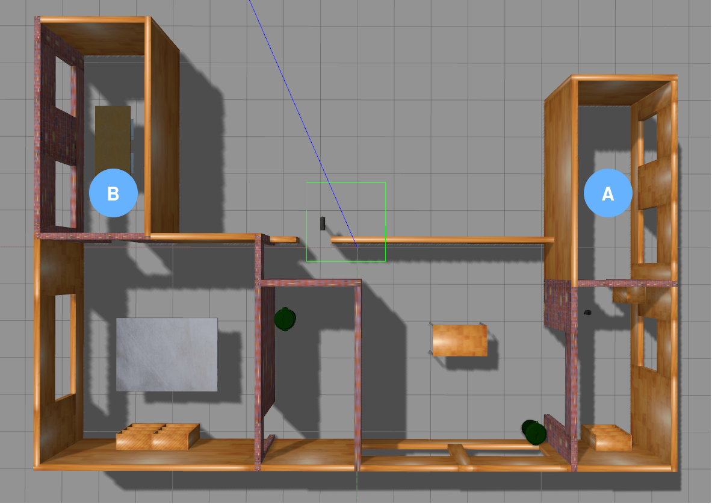
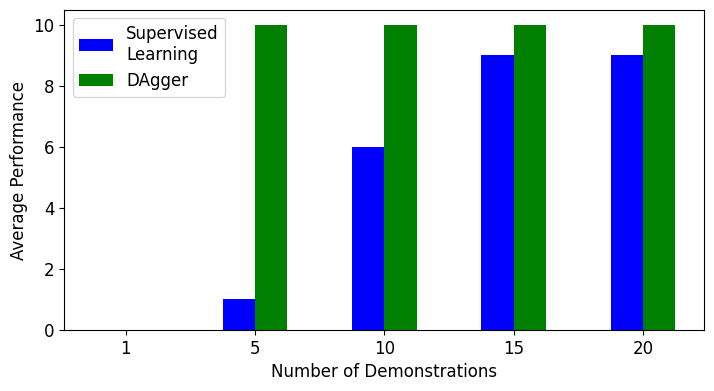

# Imitation Learning with Turtlebot 3
This is an imitation learning implementation that contains both the DAgger and standard supervised learning algorithms. The main task is to train a neural network policy that allows the robot to navigate in the turtlebot3_house gazebo environment from room A to room B in the following figure:



We use the ROS Navigation Stack as the expert policy in this case. Packages relevant to `turtlebot3_navigation` are modified and included in this repository.

## Setting Up
Clone the repository.
```
cd ~/catkin_ws/src/
git clone https://github.com/jeffrey-fong/ImitationLearning-Turtlebot3.git
cd ~/catkin_ws/ && catkin_make
```
After cloning the repository, create a virtual environment with `virtualenv` or `conda` and install the dependencies in `requirements.txt`. This is compatible with Python 3.6.

## Running DAgger and Supervised Learning
Run the following commands in different terminals:
* Launch the turtlebot3_house environment
```
roslaunch turtlebot3_gazebo turtlebot3_house.launch
```
* Run the `reset_robot_pos` node to set the robot's position to the start at room A
```
rosrun imitation_learning reset_robot_pos
```
* Launch the ROS Navigation Stack to initialize the expert
```
roslaunch turtlebot3_navigation turtlebot3_navigation.launch map_file:=$HOME/catkin_ws/src/ImitationLearning_Turtlebot3/imitation_learning/house_map.yaml
```
* Run either DAgger (`daglearner` node) or supervised learning (`learner` node) algorithms in a terminal with the virtual environment
```
source venv/bin/activate
rosrun imitation_learning daglearner
```
* Run the teleop_key to change between different modes
```
rosrun imitation_learning turtlebot3_teleop_key
```
For both learner and daglearner, press ’1’ in the terminal running `turtlebot3_teleop_key` to start collecting data. The robot will start moving to the goal position. Once the robot reaches the goal position, `learner` will reset the robot’s pose to the start and begin the next demonstration immediately. Contrarily, `daglearner` will reset the robot pose, train the neural network policy, then start the next demonstration. This process will repeat until it is stopped manually by quitting the program. For `learner`, press ’2’ after collecting enough demonstrations to train the neural network. Press ’3’ to switch to EXECUTE mode.

### Evaluating a standalone policy
To evaluate a single policy, run the `policyexec` node after running `reset_robot_pos`.
```
source venv/bin/activate
rosrun imitation_learning policyexec
```
The robot will start moving once the program starts and resets at the goal position, followed by the program quitting itself. An trained model (best_model.pt) has been included for testing after setting up. It was trained using DAgger with 20 demonstrations.

## Comparison
DAgger is compared against standard supervised learning through the number of times the robot succeeded to get to room B over 10 tries given varying demonstrations. DAgger clearly outperforms supervised learning in terms of average performance and learning speed. This demonstrates DAgger's ability to reduce distribution shift in the training and testing data.

**Average performance given number of demonstrations**

